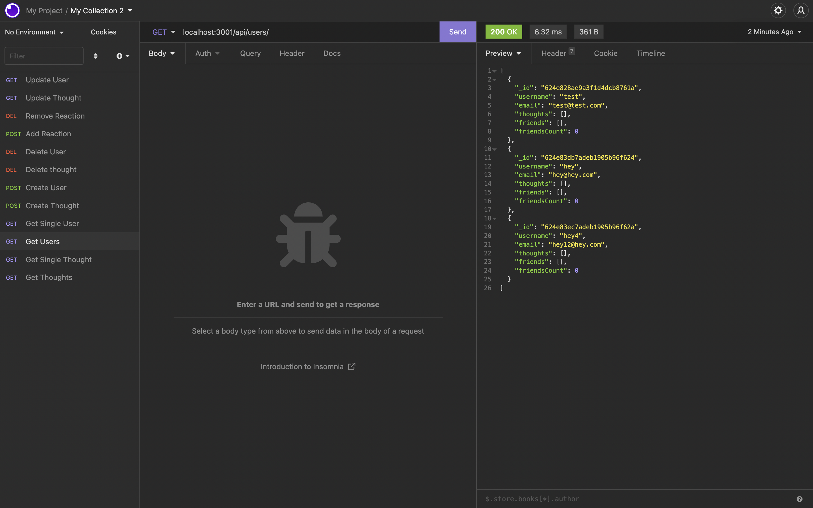

# Social-Network-API

[License](https://img.shields.io/static/v1?label=License&message=MIT&color=blueviolet&style=plastic)

## Table of contents:

- [Description](#description)
- [Installation](#installation-and-Usage)
- [Contributors](#contributors)
- [Questions](#questions)

### Description:

This is a social media api that allows users to create and update thoughts. Users can create profiles on the api and have all associated thoughts saved on our database. Users also have the option to react to other people's thoughts. Users can delete their thoughts, reactions, and profiles at anytime!

screenshots of running program: 

### Installation and Usage:

The only thing you need to run this program is node package manager! Run 'npm i' in the command line to install all the necessary dependencies. Then run 'node server.js' on your terminal or gitbash. You would need to clone the repository first!

### License:

This project is licensed under: MIT

### Contributors:

Abdirahman

### Questions:

If you have any questions contact Abdirahman on [Github](https://github.com/aden-abdirahman)
or [Email](https://aden.abdirahman45@gmail.com)

Video walkthrough of program: [Video](https://drive.google.com/file/d/14yyNUIqksB_wrWVQesIruKxgljtAY8A7/view?usp=sharing)
